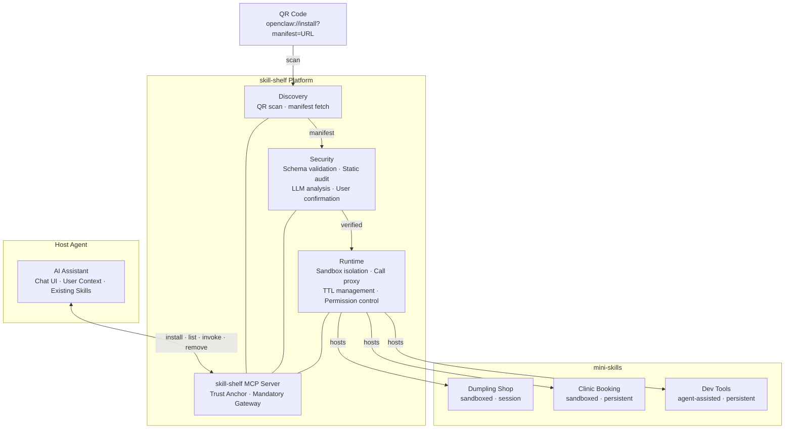

# 🧩 skill-shelf

**A mini-program runtime for AI Agents — discover, verify, sandbox, and manage ephemeral Skills via QR code.**

> Scan a QR code at a dumpling shop. Your AI assistant installs a temporary Skill,
checks the menu, gets the WiFi password, and auto-removes it when you leave.
No app store. No configuration. No trust assumptions.
> 

---

## The Problem

The MCP ecosystem has exploded to 36,000+ servers — but **every single one** is distributed online. There is no way for a user standing in a coffee shop to tell their AI assistant: *"use the WiFi tool that's posted on the wall."*

Meanwhile, MCP security tools (mcp-scan, mcpmarket, TrueFoundry) all target developers and security teams. **No solution exists for ordinary users** who need to understand risk in plain language.

And every installed MCP server stays forever — eating context window tokens, accumulating permissions, with no lifecycle management.

---

## The Solution

**skill-shelf** is a *mini-program framework for AI Agents*. Think WeChat Mini Programs, but for AI.

It sits between your AI assistant (the "host agent") and third-party Skills ("mini-skills"), acting as:

- 🔍 **Discovery layer** — scan a QR code to find a Skill
- 🛡️ **Security gateway** — verify, audit, and explain risks in plain language
- 📦 **Sandbox runtime** — isolate mini-skills so they can't access your other tools or data
- ⏱️ **Lifecycle manager** — auto-install, TTL expiry, and cleanup



---

## Key Innovations

### 🏪 Decentralized Distribution

No app store. No review process. Merchants deploy their own MCP server, generate a QR code, and users scan to install. Just like putting up a poster.

### 🧠 LLM-Native Security

Existing tools detect threats with pattern matching. skill-shelf uses **LLM reasoning** to judge whether declared capabilities match the expected scenario — a WiFi Skill requesting shell access is far more suspicious than a dev tool doing the same. Risks are explained in plain language, not security jargon.

### 🔒 Single Trust Anchor

Users install **one** platform Skill (skill-shelf). All third-party mini-skills run inside its sandbox via a call proxy. The host agent never directly connects to untrusted MCP servers.

---

## Skill Manifest

Every Skill is described by a **Manifest** — a JSON document with three layers:

1. **Acquisition** — how to obtain the Skill (`remote_endpoint`, `package`, `repository`, `bundle`, `inline`)
2. **Capability** — what it can do (name, tools, TTL)
3. **Permissions & Trust** — why you should trust it (reserved for v1+)

**Minimal example** (v0.1):

```json
{
  "$schema": "https://skill-shelf.dev/manifest/v0.1.json",
  "version": "0.1",
  "source": {
    "type": "remote_endpoint",
    "url": "https://mcp.shop.local/sse",
    "transport": "sse"
  },
  "metadata": {
    "name": "Dumpling Shop Assistant",
    "description": "Query WiFi password, today's menu, queue status",
    "author": "shop-owner",
    "version": "1.0.0",
    "icon": "🥟",
    "ttl": "session"
  },
  "tools": [
    { "name": "get_wifi_password", "description": "Get shop WiFi password" },
    { "name": "recommend_menu", "description": "Get today's recommended dishes" },
    { "name": "queue_status", "description": "Check queue position" }
  ]
}
```

👉 Full spec: [`spec/manifest-v0.1.md`](spec/manifest-v0.1.md)

---

## Roadmap

| Version | Core Capability | Manifest Fields | Complexity |
| --- | --- | --- | --- |
| **V0** | Scan → parse → register → TTL cleanup | `source` · `metadata` · `tools` | 🟢 Low |
| **V1** | Sandbox isolation + security summary + user confirmation | `permissions` · `trust` · `config` | 🟡 Medium |
| **V2** | Mini-skill list UI + agent-assisted mode + cross-skill data | `interactionMode` · `triggerHints` | 🟠 Med-High |
| **V3** | Merchant dashboard + Skill marketplace + multi-platform | Signing/audit system | 🔴 High |

---

## We Need Help With

This project is in the **spec + design** phase. We're looking for contributors in these areas:

- 📋 **Spec review** — feedback on [Manifest v0.1](spec/manifest-v0.1.md)
- 🛠️ **V0 implementation** — MCP Server skeleton, manifest parser, TTL manager
- 🔒 **Sandbox architecture** — runtime call proxy design (V1)
- 🧠 **LLM security prompts** — prompt engineering for capability analysis
- 📱 **Mobile integration** — QR scanning on MCP client apps
- 🌐 **Multi-platform** — adapting beyond OpenClaw to Claude, ChatGPT, etc.

👉 See [CONTRIBUTING.md](http://CONTRIBUTING.md) and our [open issues](../../issues) for details.

---

## Design Documents

- [Architecture Overview](docs/architecture.md) — three-layer architecture, core flow, design principles
- [Security Architecture](docs/security.md) — 7-step install pipeline, trust tiers, sandbox design
- [Architecture Decision Records](docs/adr/) — key design decisions and rationale

---

## Acknowledgements

Inspired by WeChat Mini Programs and the MCP ecosystem. Built on the shoulders of [OpenClaw](https://openclaw.dev), [mcp-scan](https://github.com/invariantlabs-ai/mcp-scan), and the [Model Context Protocol](https://modelcontextprotocol.io) specification.

---

## License

Apache 2.0