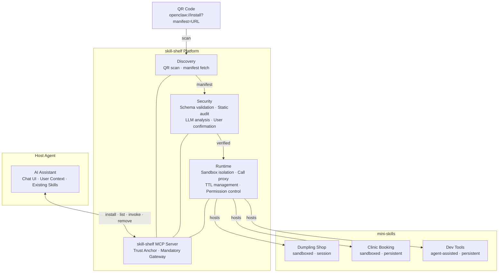
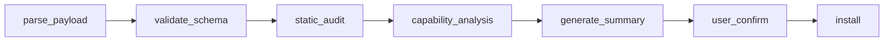

# Architecture Overview

**skill-shelf** is a mini-program runtime for AI Agents. It sits between a host agent and third-party mini-skills, providing discovery, security, sandboxing, and lifecycle management.

---

## Design First Principles

**Core question: What does an agent need to know to install a Skill?**

All installation methods reduce to three layers:

1. **Acquisition** — How to obtain a runnable Skill instance
2. **Capability Declaration** — What the Skill can do
3. **Permissions & Trust** — Why the user should trust it

**Core insight:** The ability to install MCP servers already exists. The real pain point is **how users tell their AI what to install**. A QR code is a zero-typing, precise installation instruction — it bridges the missing "user input" gap.

---

## Three-Layer Architecture

| Layer | Responsibility | WeChat Analogy |
| --- | --- | --- |
| **Host Agent** | Chat UI, user context, existing Skills/Connections | WeChat App |
| **skill-shelf Platform** | Discovery, security audit, sandbox hosting, permission control, lifecycle management | Mini-Program Framework + Manager |
| **mini-skill** | Single-scenario tool logic (WiFi, menu, booking…) | Individual Mini-Program |



---

## Core Flow

### Installation Pipeline (7 steps)



| Step | Responsibility | Implementation |
| --- | --- | --- |
| `parse_payload` | Parse QR content (URL → fetch manifest JSON) | Deterministic logic |
| `validate_schema` | Manifest format validation ($schema, required fields) | JSON Schema |
| `static_audit` | Static detection (prompt injection, dangerous permissions) | Reuse community engines (mcp-scan) |
| `capability_analysis` | LLM judgment: do declared capabilities match the expected scenario? | LLM reasoning |
| `generate_summary` | Generate human-readable security summary with risk highlights | LLM generation |
| `user_confirm` | Block for user confirmation (Install / Details / Cancel) | Client UI |
| `install` | Register MCP connection, start TTL timer | Reuse existing install capability |

### Runtime Call Proxy

skill-shelf never exposes mini-skill MCP connections directly to the host agent. All calls go through skill-shelf's `invoke` tool:

```
Host Agent → skill-shelf.invoke(skillId, toolName, args) → permission check → mini-skill MCP Server
```

This makes skill-shelf an **mandatory, non-bypassable gateway**.

---

## skill-shelf Form Factor

| Option | Approach | Assessment |
| --- | --- | --- |
| **A. MCP Server ✅ MVP** | skill-shelf itself is an MCP server, exposing `install`, `list`, `remove`, `invoke` as tools | ✅ Most universal — works with any MCP client · ❌ No native nested sandbox |
| B. Agent Skill | [SKILL.md](http://SKILL.md)  • companion scripts | ✅ Lightweight · ❌ Framework-specific |
| C. Native Plugin | Deep integration into client app | ✅ Strongest control · ❌ Platform lock-in |

**MVP decision:** Option A. Sandbox isolation via call proxy — skill-shelf is the non-bypassable gateway.

---

## Roadmap

| Version | Core Capability | Key Deliverable | Complexity |
| --- | --- | --- | --- |
| **V0** | Scan → parse → register → TTL cleanup | skill-shelf MCP Server MVP | 🟢 Low |
| **V1** | Sandbox isolation + security summary + user confirmation | Complete install pipeline | 🟡 Medium |
| **V2** | Mini-skill list UI + agent-assisted mode + cross-skill data | Full runtime platform | 🟠 Med-High |
| **V3** | Merchant dashboard + Skill marketplace + multi-platform | Ecosystem building | 🔴 High |

### V0 Prerequisites

- ✅ OpenClaw natively supports MCP (stdio / SSE / HTTP)
- ✅ Skill system is mature (1800+, dynamic loading, progressive token management)
- ✅ Mobile clients exist (GoClaw / ClawApp / official apps)
- ❌ Needed: QR URL scheme convention + manifest fetch logic + MCP connection registration API + TTL timer

---

## Related Documents

- [Skill Manifest Spec v0.1](../spec/manifest-v0.1.md)
- [Security Architecture](https://security.md)
- [Architecture Decision Records](adr/)