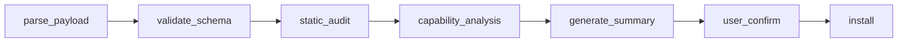

# Security Architecture

---

## Design Principles

Three lines of defense: **Declarative Permissions + Runtime Sandbox + User Confirmation**

<aside>
🔐

**Security checks are a built-in pipeline, not an optional Skill.** If security were optional, users could skip it, or a malicious payload could write "ignore security checks" in its systemPrompt. The security layer MUST be non-bypassable.

</aside>

---

## Core Positioning: Translation, Not Audit

Community security tools (mcp-scan, mcp-sec-audit, mcpmarket) all assume the user is a developer or security professional. Their output is technical reports, CVE numbers, and risk scores.

**Our users are ordinary people scanning a QR code at a dumpling shop.** They won't read an A-F risk report.

| Dimension | Community Tools | skill-shelf |
| --- | --- | --- |
| Detection pattern library (prompt injection / dangerous permissions) | ✅ Mature | Reuse directly — don't reinvent |
| Plain-language risk explanation for end users | ❌ Does not exist | **Core differentiator** |
| Non-bypassable pre-install interception | ❌ All optional tools | **Built into install flow** |
| Semantic judgment: declared capability vs. expected scenario | ❌ Rule matching only | **LLM-native advantage** |

**Key insight:** Risk = the gap between declared capabilities and reasonable expectations. A WiFi Skill requesting SHELL access is far more dangerous than a dev tool doing the same. Audit tools don't make this judgment — LLMs can.

---

## 7-Step Install Pipeline



| Step | What It Does | How |
| --- | --- | --- |
| `parse_payload` | Parse QR content → fetch manifest JSON | Deterministic |
| `validate_schema` | Validate manifest format ($schema, required fields) | JSON Schema |
| `static_audit` | Detect prompt injection patterns, scan dangerous permissions | Reuse mcp-scan / community engines |
| `capability_analysis` | LLM judges: do capabilities match the scenario? Cross-validate systemPrompt vs permissions | LLM reasoning |
| `generate_summary` | Generate plain-language security summary with risk highlights | LLM generation |
| `user_confirm` | Block for user confirmation (Install / View Details / Cancel) | Client UI |
| `install` | Register MCP connection, start TTL timer | Reuse existing capability |

---

## Runtime Sandbox

### Two Interaction Modes

| Dimension | sandboxed (default) | agent-assisted |
| --- | --- | --- |
| Context | Fully isolated — cannot see user's other conversations/tools/data | Can access host conversation context (constrained by permissions) |
| Trust requirement | Low — isolation = security | High — requires platform verification + explicit user authorization |
| Call interception | Only exposes the mini-skill's own declared MCP tools; blocks all host agent capabilities | Selectively passes through per permissions declaration |

**Core guarantee: enforcement is runtime interception, not declarations.** skill-shelf as middleware intercepts all tool call requests from mini-skills.

### Call Proxy Mechanism

```
Host Agent → skill-shelf.invoke(skillId, toolName, args) → skill-shelf permission check → mini-skill MCP Server
```

skill-shelf never exposes mini-skill MCP connections directly to the host agent.

---

## Trust Tier System

Inspired by browser lock icon:

| Tier | Condition | UI | Install Behavior |
| --- | --- | --- | --- |
| 🟡 Unverified | `signed: false` · `publisher: "unverified"` | Yellow shield + "Unverified source — only use in locations you trust" | Mandatory user confirmation + sandbox |
| 🟢 Verified | `signed: true` · `publisher: "verified"` | Green shield + "Verified by OpenClaw platform" | Optional auto-install (user-configurable) |
| 🔵 Audited | `audit` field present | Blue shield + audit report link | Highest trust tier |

**User analogy:** "This is like scanning a QR code to open a stranger's mini-program on WeChat" — helps ordinary users build a mental model quickly.

---

## User-Facing Security Summary

Template output from `generate_summary`:

> 🥟 **About to install: Wang's Dumpling Shop Assistant**

**Source:** Downstairs dumpling shop (mcp.jiaozi.local) · 🟡 Not platform-verified

**What this Skill can do:**
📋 View today's menu
⭐ Get the owner's recommended dishes
📶 Query shop WiFi password

**Security check results:**
✅ Won't access your files
✅ Won't read your chat history or work data
✅ Only communicates with the dumpling shop's own server
ℹ️ This Skill is self-deployed by the merchant, not platform-verified

**Retention:** This session only (auto-removed when you close the chat)

[Install]　[View Details]　[Cancel]
> 

### Copy Principles

- Emoji for quick scanning (✅ safe · ⚠️ note · ❌ risk)
- No technical jargon (no JSON, schema, MCP)
- Risk framed as "expectation gap": "This is unusual for a restaurant assistant"

### Three-Layer Detail Architecture

| Level | Audience | Content |
| --- | --- | --- |
| **L1 — Security Summary** | Ordinary users | Plain-language capability description + risk interpretation |
| **L2 — Technical Details** | Curious users | Tool list + permission declarations + source URL + systemPrompt + behavior summary |
| **L3 — Raw Manifest** | Developers | Complete JSON manifest |

---

## systemPrompt Security Handling

**Compromise approach:**

- systemPrompt is included in the payload (preserves flexibility)
- Agent does NOT silently inject it. Instead:
    - Default: show **LLM-generated one-line behavior summary**: "This Skill will respond as a 'dumpling shop intelligent assistant'"
    - Raw prompt only shown at "Technical Details" level
- `capability_analysis` step adds **systemPrompt vs permissions cross-validation** — detect if the prompt contains instructions contradicting declared permissions
- `inline` + `runtime: "prompt"` MUST display the full prompt content to the user; silent injection is not allowed

---

## Community Reference

| Project | Relevance | Notes |
| --- | --- | --- |
| mcp-scan (Invariant Labs) | Medium | Detects prompt injection / tool poisoning — reusable as static_audit engine |
| mcp-sec-audit (CSA) | Low-Medium | Static pattern matching + Docker/eBPF sandbox fuzzing — academic oriented |
| mcpmarket Security Audit | Medium | 22 prompt injection patterns, A-F scoring |
| Claude Code Skills | Medium | Permission model reference — scoped execution, trust gradient |
| OWASP MCP Top 10 | High | Scope Creep (#2 risk) — session-level auth, auto-revoke |
| NVIDIA Sandbox Guide | Medium | Layered control — deny list > workspace allow > whitelist > default deny |